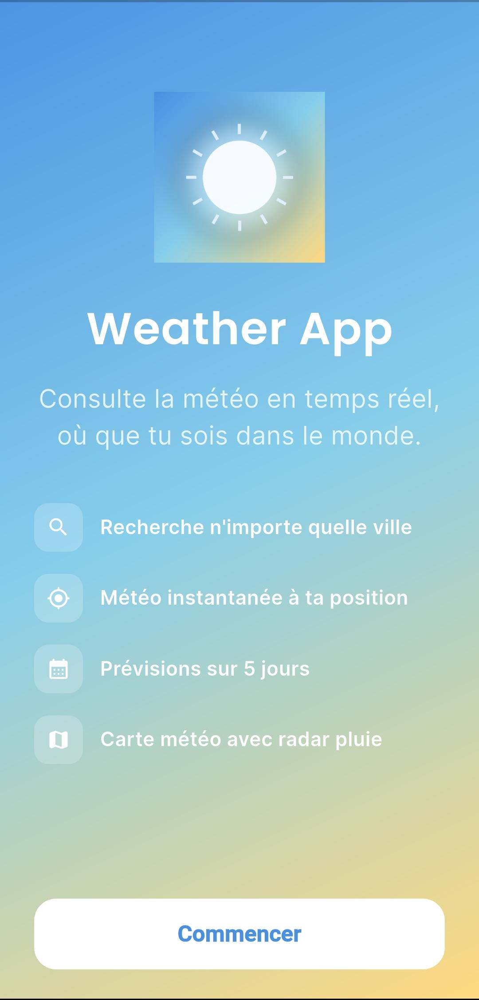
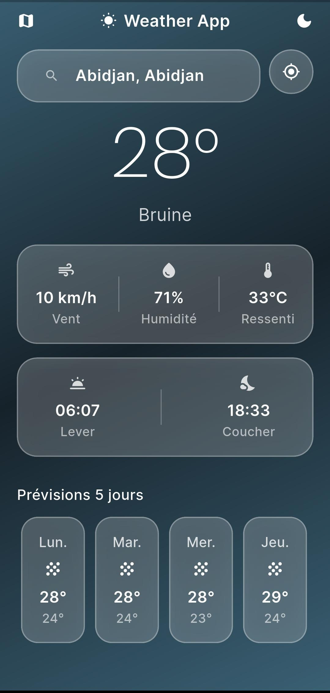
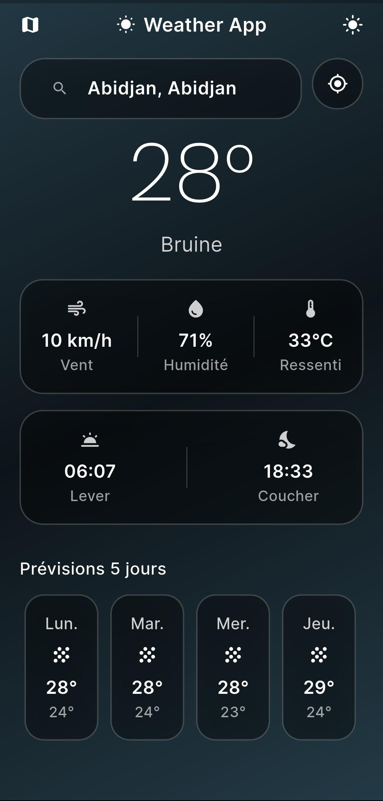
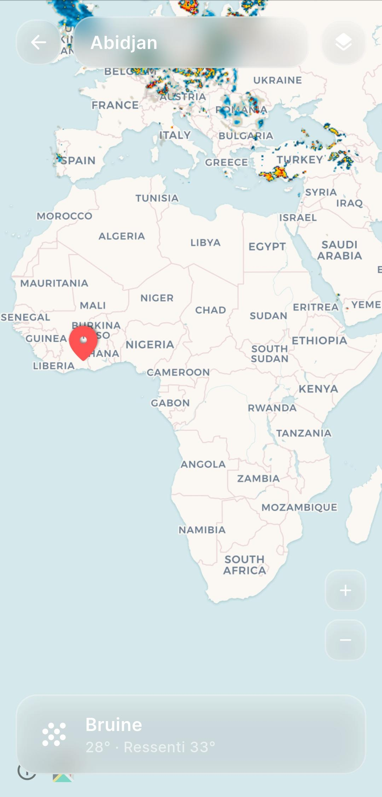

# 🌤️ Weather

Une application météo moderne construite avec Flutter, au design glassmorphism, offrant une expérience fluide pour consulter la météo de n'importe quelle ville dans le monde.


---

## 📱 Aperçu

| Onboarding | Accueil (clair) | Accueil (sombre) | Carte météo |
|---|---|---|---|
|  |  |  |  |

---

## ✨ Fonctionnalités

- 🔍 **Recherche de ville** avec suggestions en temps réel (autocomplete)
- 📍 **Position GPS actuelle** — météo instantanée où que tu sois
- 🌡️ Température, ressenti, vent, humidité
- 🌅 Heures de lever et coucher du soleil
- 📅 Prévisions détaillées sur **5 jours**
- 🌙 **Mode sombre** intégral
- 🗺️ **Carte météo interactive** avec couche radar de précipitations en temps réel
- 🎨 Interface **glassmorphism** avec dégradés dynamiques selon la météo et l'heure du jour

---

## 🛠️ Stack technique

| Composant | Technologie |
|---|---|
| Framework | Flutter |
| Langage | Dart |
| Gestion d'état | Provider |
| Météo & géocodage | [Open-Meteo](https://open-meteo.com/) (API gratuite, sans clé) |
| Radar pluie | [RainViewer](https://www.rainviewer.com/api.html) (API gratuite, sans clé) |
| Fond de carte | [CARTO](https://carto.com/basemaps) via `flutter_map` |
| Géolocalisation | `geolocator` |
| Typographie | `google_fonts` (Poppins, Inter) |

---

## 📂 Structure du projet

```
lib/
├── main.dart
├── models/
│   └── weather.dart
├── screens/
│   ├── splash_screen.dart      # Onboarding + logo
│   ├── home_screen.dart        # Écran principal
│   └── details_screen.dart     # Carte météo + radar
├── services/
│   ├── weather_service.dart    # Appels API Open-Meteo
│   ├── location_service.dart   # Géolocalisation
│   └── radar_service.dart      # Tuiles radar RainViewer
├── widgets/
│   ├── glass_container.dart    # Composant glassmorphism réutilisable
│   ├── search_bar.dart         # Barre de recherche avec suggestions
│   ├── weather_card.dart       # Card météo principale
│   └── forecast_card.dart      # Card de prévision journalière
└── utils/
    ├── constants.dart          # Design system (couleurs, dégradés, typographie)
    └── theme_provider.dart     # Gestion du mode sombre
```

---

## 🚀 Installation

### Prérequis
- [Flutter SDK](https://docs.flutter.dev/get-started/install) installé
- Un émulateur ou un appareil physique connecté

### Étapes

```bash
# Cloner le dépôt
git clone https://github.com/ouattaraulrich/weather_app.git
cd weather_app

# Installer les dépendances
flutter pub get

# Lancer l'application
flutter run
```

Aucune clé API n'est nécessaire — Open-Meteo et RainViewer sont entièrement gratuits et libres d'accès.

---

## 📦 Dépendances principales

```yaml
dependencies:
  http: ^1.2.2
  provider: ^6.1.2
  geolocator: ^13.0.1
  intl: ^0.19.0
  google_fonts: ^6.2.1
  flutter_map: ^7.0.2
  latlong2: ^0.9.1

dev_dependencies:
  flutter_launcher_icons: ^0.14.1
```

---

## 🗺️ Roadmap

- [x] Recherche de ville avec suggestions
- [x] Position GPS
- [x] Mode sombre
- [x] Carte météo avec radar

---

## 📄 Licence

Ce projet est sous licence MIT — libre d'utilisation à des fins personnelles ou éducatives.

---

## 👤 Auteur

**Ouattara Ulrich (Marvin)**
Étudiant en développement — Côte d'Ivoire